# Predictive Analysis of Hepatitis

## Author: [Michael Holdbrooke](mickybroox@gmail.com)

### 20th April, 2021

---

## Introduction

Hepatitis is an inflammation of the liver, a medical condition that is often caused by a viral infection. However, as it is commonly known that the disease is caused by a viral infection, there are other possible conditions that can cause hepatitis which include but not limited to autoimmune hepatitis (_Autoimmune hepatitis is a disease that occurs when your body makes antibodies against your liver tissue._) and hepatitis that occurs as a result of some medications (**_[healthline](https://www.healthline.com/health/hepatitis)_**, 9th May, 2017)., drugs, toxins, and heavy use of alcohol (alcoholic hepatitis) (**_[Centers for Disease Control and Prevention](https://www.cdc.gov/hepatitis/abc/index.htm)_**).

Hepatitis can be classified as into five (5) categories that is; hepatitis A, B, C, D, and E. Hepatitis A and E are considered to be acute, while hepatitis B, C, and D are considered to be chronic (**_[healthline](https://www.healthline.com/health/hepatitis)_**, 9th May, 2017)..

+ Hepatitis A is caused by the hepatitis A virus (**`HAV`**),

---

+ Hepatitis B is caused by the hepatitis B virus (**`HBV`**),

---

+ Hepatitis C is caused by the hepatitis C virus (**`HCV`**),

---

+ Hepatitis D is caused by the hepatitis D virus (**`HDV`**), and

---

+ Hepatitis E is caused by the hepatitis E virus (**`HEV`**).

---

According to an article that was published on WHO (World Health Organization) Africa's website, _'There is limited data available for the specific types of viral hepatitis in Ghana. Surveillance data from all the ten regions in the country shows an increasing annual trend in the number of clinical viral hepatitis cases. At the end of 2012, a total of `12,740 cases` with `162 deaths` were reported, a `110% increase` compared to 2011 where `5,915 cases` with `78 deaths` were reported.'_ (**_["My untold story" - A hepatitis patient in Ghana shares his experience](https://www.afro.who.int/news/my-untold-story-hepatitis-patient-ghana-shares-his-experience)_**, 27th July, 2016).

A lot people who have hepatitis do not show any symptoms and are not aware that they are infected. Symptoms can show from 2 weeks to 6 months after exposure if it is an acute infection, whiles symptoms of chronic viral hepatitis can take a very long time to develop (**_[Centers for Disease Control and Prevention](https://www.cdc.gov/hepatitis/abc/index.htm)_**). Common symptoms of hepatitis can include:

+ Nausea

---

+ Fever

---

+ Fatigue

---

+ Flu-like symptoms

---

+ Dark urine

---

+ Pale stool

---

+ Abdominal pain

---

+ Joint pain

---

+ Loss of appetite

---

+ Vomiting

---

+ Unexplained weight loss

---

+ Yellow skin and eyes, which may be signs of jaundice (**_[healthline](https://www.healthline.com/health/hepatitis)_**, 9th May, 2017).

---

In diagnosing hepatitis, a doctor will take a patient's history to determine any risk factors for infectious or non-infectious hepatitis. A physical examination will be done by the doctor and during the process of examining the patient, the doctor may press down gently on the abdomen to see if there’s pain or tenderness. He may also feel to see if the liver is enlarged and if the skin or eyes of a patient seems to be yellowish, the doctor will notice it as he performs the physical examination (**_[healthline](https://www.healthline.com/health/hepatitis)_**, 9th May, 2017).

Also, in diagnosing hepatitis, several test are performed to know the condition the liver is in. A liver function test as one of these test is performed to detect any abnormalities with regards to how the liver functions. This test uses blood samples to determine how efficiently a liver works and if there are any abnormalities, further blood tests can be performed to detect the source of the problem. These blood tests can be done to check for the viruses that cause hepatitis and also the antibodies that are commonly found in conditions like autoimmune hepatitis. Again, an ultrasound test is another test that can be performed to determine the cause of abnormalities in how the liver functions. With the help of ultrasound waves, an ultrasound test when performed on the abdomen, creates an image of the organs within the abdomen. This test gives the doctor a chance to take a closer look at the liver and other organs that are near the liver. It reveals:

+ Liver damage or enlargement

---

+ Abnormalities of the gallbladder

---

+ Fluid(s) in the abdomen and

---

+ Liver tumors (**_[healthline](https://www.healthline.com/health/hepatitis)_**, 9th May, 2017).

---

To add up, a liver biopsy can also be performed to determine how infections have affected the liver. This process involves the taking of liver tissue samples through the skin with the help of a needle and typically guided with an ultrasound when through the process (**_[healthline](https://www.healthline.com/health/hepatitis)_**, 9th May, 2017).

**This project aims to determine whether a hepatitis patient will live or die base on certain factors and medical conditions after a patient has been examined and gone through the necessary tests to confirm that he or she has hepatitis.**

## Dataset, Features and Target Variable

The dataset used in this experiment consist of  **`155 entries`** (rows) with 20 columns and it is available at the **_[UCI machine learning repository](https://archive.ics.uci.edu/ml/datasets/hepatitis)_**.

### Data Features

The data features consist of:

+ **`CLASS`** - **_Class determines whether a patient died or lived._**

---

+ **`AGE`** - **_Age determines how old the patient is._**

---

+ **`SEX`** - **_Sex indicates the gender of the patient._**

---

+ **`STEROID`** - **_Steroid indicates whether there is steroid usage by the patient._**

---

+ **`ANTIVIRALS`** - **_Antivirals indicates whether there is the usage of antiviral drugs by the patient._**

---

+ **`FATIGUE`** - **_Fatigue is a term used to describe an overall feeling of tiredness or lack of energy._**

---

+ **`MALAISE`** - **_A general sense of being unwell, often accompanied by fatigue, diffuse pain or lack of interest in activities ([MedicalNewsToday](https://www.medicalnewstoday.com/articles/327062), 20th November, 2019)._**

---

+ **`ANOREXIA`** - **_An eating disorder that causes people to be obsess about their weight and what they eat ([Mayo Clinic](https://www.mayoclinic.org/diseases-conditions/anorexia-nervosa/symptoms-causes/syc-20353591))._**

---

+ **`LIVER BIG`** - **_Describes whether a patient's liver is enlarged or not. An enlarged liver is a liver that is bigger than a normal liver._**

---

+ **`LIVER FIRM`** - **_Describes whether a patient's liver is firm or not. The edges of a liver is normally thin and firm_**.

---

+ **`SPLEEN PALPABLE`** - **_Describes whether the spleen of a patient is easily noticeable or not. The spleed is an important organ that is part of the lymphatic system. It helps in keeping bodily fluids balanced, and also helps in removing cellular waste. ([Live Science](https://www.livescience.com/44725-spleen.html), 4th April 2018)_**

---

+ **`SPIDERS`** - **_Vascular Spider is a common benign vascular anomaly that may appear as solitary or multiple lesions. This feature determines whether a patient has spiders or not._**

---

+ **`ASCITES`** - **_Ascites is extra fluid in the space between the tissues lining the abdomen and the organs in the abdominal cavity (such as the liver, spleen, stomach). Ascites determines whether if there's an extra fluid in the abdominal cavity of a patient_**

---

+ **`VARICES`** - **_This determines whether a patient is exhibiting varices. Varices happens when the liver becomes scarred, and the pressure from obstructed blood flow causes veins to expand._**

---

+ **`BILIRUBIN`** - **_This feature determines the bilirubin value of a patient. The level of bilirubin in the blood goes up and down in patients with hepatitis C. High levels of bilirubin can cause jaundice (yellowing of the skin and eyes, darker urine, and lighter-colored bowel movements)._**

---

+ **`ALK PHOSPHATE`** - **_Determines the level or value of Alkaline Phosphatase of a patient. Alkaline phosphatase is an enzyme made in liver cells and bile ducts. The alkaline phosphatase level is a common test that is usually included when liver tests are performed as a group._**

---

+ **`SGOT`** - **_`Serum Glutamic-Oxaloacetic Transaminase (SGOT)` which is also known as `Aspartate Aminotransferase (AST)`, is a liver enzyme which when liver cells are damaged, leaks out into the bloodstream and increases the level of AST in the blood. This feature measures or determines the level of `SGOT` in the bloodstream of a patient_**

---

+ **`ALBUMIN`** - **_This features determines a patient's albumin level. A low albumin level in patients with hepatitis C can be a sign of cirrhosis (a liver disease). Albumin levels can go up and down slightly. Very low albumin levels can cause symptoms of edema, or fluid accumulation, in the abdomen (called ascites) or in the leg (called edema)._**

---

+ **`PROTIME`** - **_`Prothrombin Time` (PT) is one way of measuring how long it takes blood to form a clot, and it is measured in seconds (such as 13.2 seconds). A normal PT indicates that a normal amount of blood-clotting protein is available._**

---

+ **`HISTOLOGY`** - **_Histology is the study of microscopic structures of tissues. Once a tissue sample is taken from a patient, histology technicians are the people responsible for preparing samples for pathologists to examine for diagnostic or research purposes ([Mayo Clinic](https://college.mayo.edu/academics/explore-health-care-careers/careers-a-z/histology-technician/))._**

---

### Missing Values

Missing values in the dataset was indicated with **`?`** and there were a total number of **166** missing values found in the entire dataset.

The table below summarizes the missing values that were found in the dataset;

|   Column      |Total|Percent           |Types |
|---------------|-----|------------------|------|
|protime        |66   |42.86             |object|
|alk_phosphate  |29   |18.83             |object|
|albumin        |16   |10.39             |object|
|liver_firm     |11   |7.14              |object|
|liver_big      |10   |6.49              |object|
|bilirubin      |6    |3.90              |object|
|spleen_palpable|5    |3.25              |object|
|spiders        |5    |3.25              |object|
|ascites        |5    |3.25              |object|
|varices        |5    |3.25              |object|
|sgot           |4    |2.60              |object|
|steroid        |1    |0.65              |object|
|fatigue        |1    |0.65              |object|
|malaise        |1    |0.65              |object|
|anorexia       |1    |0.65              |object|
|class          |0    |0.0               |int64 |
|age            |0    |0.0               |int64 |
|antivirals     |0    |0.0               |int64 |
|sex            |0    |0.0               |int64 |
|histology      |0    |0.0               |int64 |

---

Missing Values in the dataset were replaced with the median value of each of the columns that had missing values.

### Duplicated Values

There were **no duplicated values** found in the dataset.

### Target Variable

The target variable, `class` is a norminal categorical feature that determines whether a patient died or lived. This makes this predictive task a typical machine learning classification problem. A distribution plot of the class variable was plotted to study how it is distributed as shown below;

The number of instances for each category under the class data feature was counted and the results (from the highest to the lowest) indicated that there were **122** patients that lived and a total number of **32** patients that died.

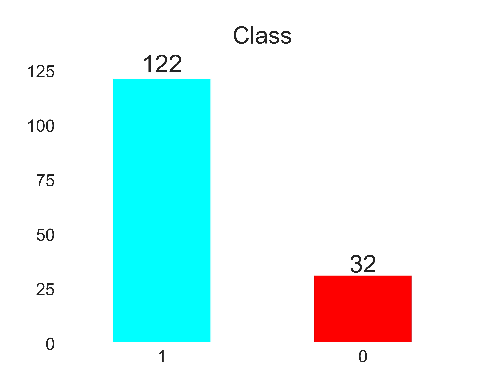

## Exploration Data Analysis

### Statistical Summary of Categorical Features

The dataset set has a total number of 14 categorical features which include:

+ `class`,

---

+ `sex`,

---

+ `steroid`,

---

+ `antivirals`,

---

+ `fatigue`,

---

+ `malaise`,

---

+ `anorexia`,

---

+ `liver_big`,

---

+ `liver_firm`,

---

+ `spleen_palpable`,

---

+ `spiders`,

---

+ `ascites`,

---

+ `varices`,

---

+ `histology`

---

The statistical summary of categorical features of the hepatitis data set is as shown below;

|column_name    |count |unique|top |freq|
|---------------|------|------|----|----|
|class          |154   |2     |Live|122 |
|sex            |154   |2     |Male|139 |
|steroid        |154   |2     |Yes |79  |
|antivirals     |154   |2     |Yes |130 |
|fatigue        |154   |2     |No  |101 |
|malaise        |154   |2     |Yes |93  |
|anorexia       |154   |2     |Yes |122 |
|liver_big      |154   |2     |Yes |130 |
|liver_firm     |154   |2     |Yes |94  |
|spleen_palpable|154   |2     |Yes |124 |
|spiders        |154   |2     |Yes |103 |
|ascites        |154   |2     |Yes |134 |
|varices        |154   |2     |Yes |136 |
|histology      |154   |2     |No  |84  |

### Statistical Summary of Numerical Features

A total number of 6 numerical features were indentified in the hepatitis dataset and they are:

+ `age`,

---

+ `bilirubin`,

---

+ `alk_phosphate`,

---

+ `sgot`,

---

+ `albumin`,

---

+ `protime`

---

The statistical summary of numerical features of the hepatitis data set is as shown below;

|column         |count |mean  |std   |min  |25%  |50%  |75%   |max  |
|---------------|------|------|------|-----|-----|-----|------|-----|
|age            |154.0 |41.27 |12.57 |7.0  |32.0 |39.0 |50.0  |78.0 |
|bilirubin      |154.0 |1.41  |1.20  |0.3  |0.8  |1.0  |1.5   |8.0  |
|alk_phosphate  |154.0 |101.63|47.21 |26.0 |78.0 |85.0 |119.75|295.0|
|sgot           |154.0 |85.61 |88.71 |14.0 |33.0 |58.0 |99.5  |648.0|
|albumin        |154.0 |3.84  |0.621 |2.1  |3.5  |4.0  |4.2   |6.4  |
|protime        |154.0 |61.49 |17.25 |0.0  |57.0 |61.0 |65.5  |100.0|

### Outliers

A total number of **`88`** outliers were found in the numerical features of the dataset with **`protime`** being the data feature with the highest number of outliers (**`41.00`**) followed by **`bilirubin`** (**`17.00`**) and **`age`** having the least with just **`1`** outlier present.

A summary of the outliers can be found as a csv file named **`outlier_info.csv`** in the **`csv_tables`** directory of this repository.

Here, you can see a figure of the distribution and boxplot of **`protime`**, all other plots can be found in the **`Hepatitis Mortality EDA and Data Cleaning`** notebook and also in the **`figures`** directory of this repository.

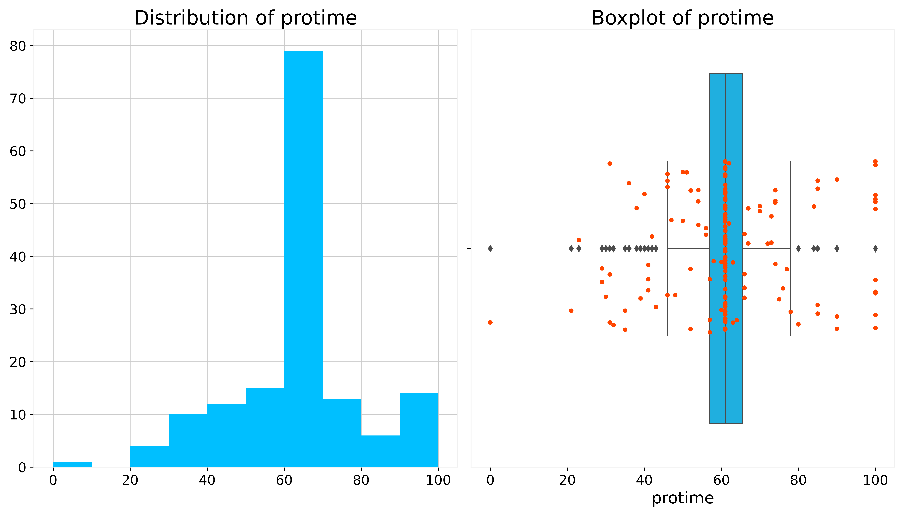

### Correlation of Data Features

Correlation between the target variable and rest of the data features was studied to know which ones have an effect in deciding whether a hepatitis patient dies or not.

The table below shows the correlation values between the target variable and the data features;

|column         |class               |
|---------------|--------------------|
|class          |1.0                 |
|ascites        |0.4686805164226333  |
|albumin        |0.4555371421869803  |
|spiders        |0.3877625892359525  |
|varices        |0.3616439401780166  |
|malaise        |0.33785926119290477 |
|protime        |0.3076322398340588  |
|fatigue        |0.3036238898771819  |
|spleen_palpable|0.23301645527602222 |
|sex            |0.1682415664237612  |
|steroid        |0.14138711436988508 |
|anorexia       |0.132172131147541   |
|liver_firm     |0.017475088984917935|
|sgot           |-0.0672354277788715 |
|liver_big      |-0.08767771540168028|
|alk_phosphate  |-0.1240715055559367 |
|antivirals     |-0.13180310158422473|
|age            |-0.21743413128870417|
|histology      |-0.33603329346500743|
|bilirubin      |-0.4444143386636536 |

Here, you can see a figure of a bar chart of the of the above data table.

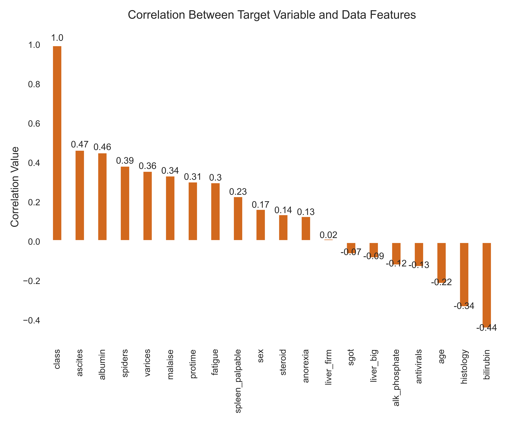

A boxplot was plotted to study the distribution between the target variable and data features with continuous values.

Here, you can see a boxplot of `bilirubin` and `class`, all other plots can be found in the **`Hepatitis Mortality EDA and Data Cleaning`** notebook and also in the **`figures`** directory of this repository.

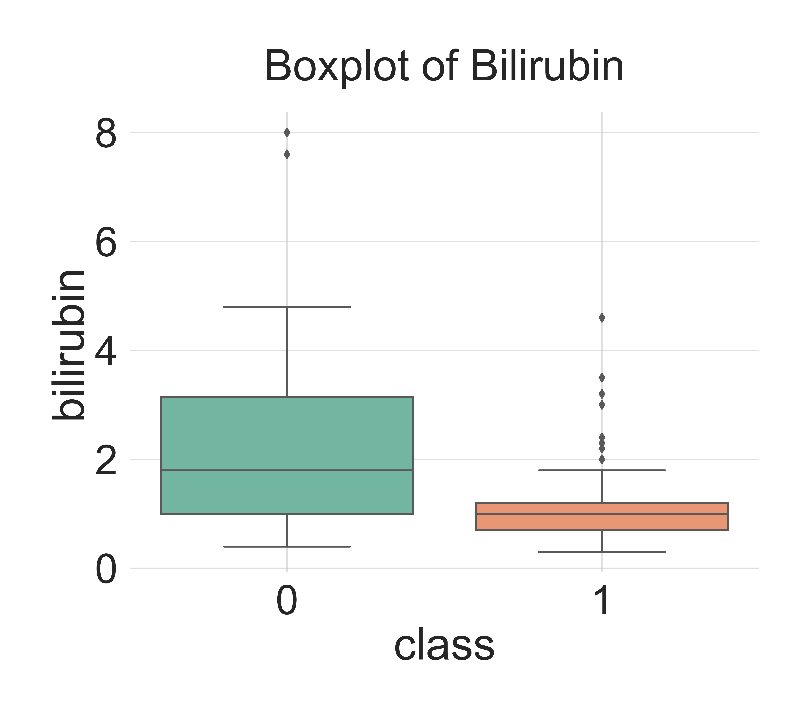

A correlation matrix was then plotted to study how data features correlate with each other. A heatmap of the correlation between all data features can be seen below.

From the above heatmap, it was observed that apart from the correlation information we had about the target variable and the rest of the data features, there were strong correlations between some of the data features.

The table below shows the correlation values between some of the data features;

|column 1       |column 2     |correlation_value|
|---------------|-------------|-----------------|
|class          |bilirubin    |-0.44441433866365|
|bilirubin      |varices      |-0.39133005916485|
|bilirubin      |albumin      |-0.37015774462580|
|varices        |histology    |-0.35793601623912|
|histology      |spiders      |-0.35518513765399|
|liver_firm     |alk_phosphate|-0.35400504486948|
|ascites        |histology    |-0.34561935177071|
|histology      |class        |-0.33603329346501|
|albumin        |alk_phosphate|-0.33586354383389|
|albumin        |histology    |-0.30657134826218|
|ascites        |albumin      |0.536680011700546|
|malaise        |fatigue      |0.586679200044203|
|anorexia       |malaise      |0.599647066092061|

### Relationship Between Bilirubin and Class

Upon discovering that `bilirubin` and `class` data features had a negative correlation value, a scatter plot was drawn to further analyse the relationship between the two features. The figure below shows the relationship between the two features;

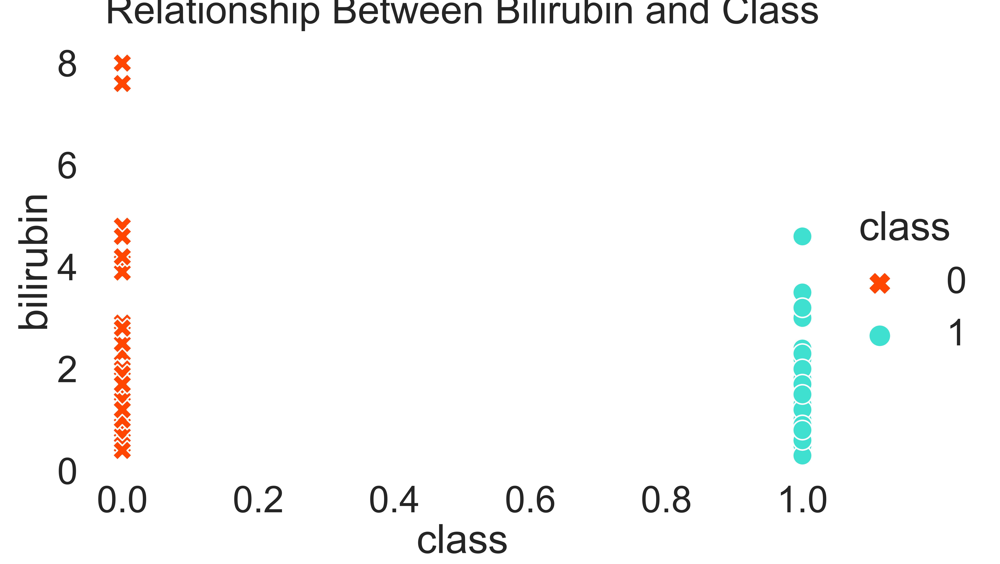

From the above figure, it was observed that, the number of hepatitis patients who died increases with increasing bilirubin values and the number of patients who lived increases with decreasing bilirubin values. This indicates that a hepatitis patient with a high bilirubin value is likely to die and a patient with low bilirubin value is likely to live.

### Analysing the **`sex`** Data Feature

The `sex` data feature was analysed to know the number of males and females hepatitis patients present in the entire dataset. The analysis showed that, there were `139 (90.3%) Males` and `15 (9.7%) Females` in the entire dataset which certainly makes this particular data feature unfit to be used in the predictive modelling because of the huge bias between males and females.

Here, you can see a figure of a bar chart and a pie chart of the **`sex`** data feature, all other plots of the rest of the data features can be seen in the **`Hepatitis Mortality EDA and Data Cleaning`** notebook and also in the **`figures`** directory of this repository.

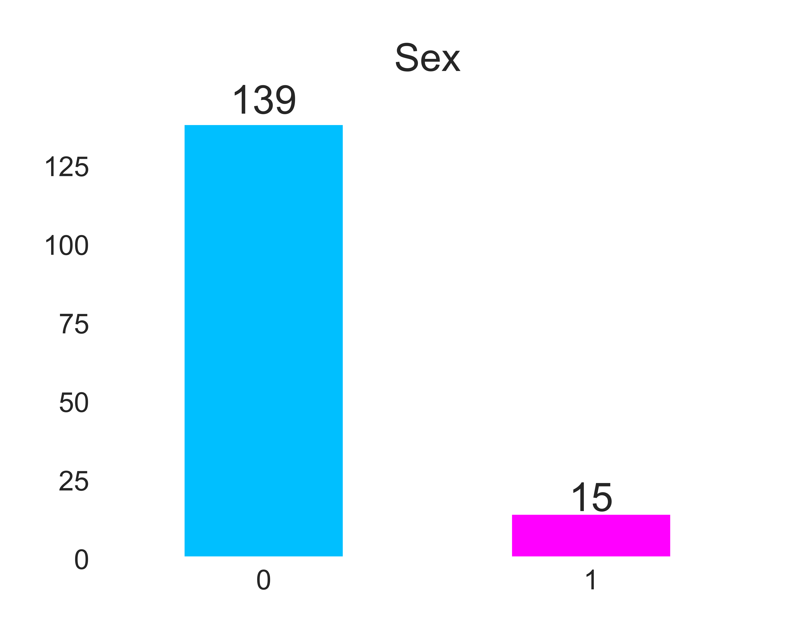

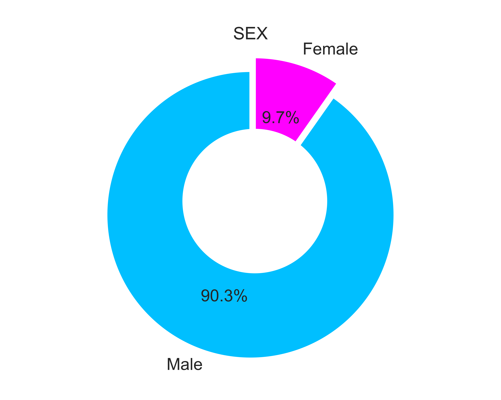

### Analysing the **`age`** Data Feature

The `age` data features was analysed to know how the age of the hepatitis patients is distributed. Upon anlysing this data feature, it was observed that, a total number of **50** hepatitis patients were between the ages of **`30 and 40`** and a total number of **35** patients were between the ages of **`40 and 50`**

Here, a frequency distribution plot of the `ages` of the hepatitis patients can be seen;

### Relationship Between Numerical (Continuous) Features and Age per Target Feature

An analysis was done to understand the relation between the `numerical features and age` per the categories under the target variable, `class`.

Taking the numerical variable `bilirubin` for example; it was observed that, most of hepatitis patients who died were between the ages of `20 and 60`. None of them was `below the age of 20` with most of them having bilirubin values `below 5.0` even though there were high bilirubin values recorded. Also, the ages of most of the patients who lived were centered between `20 and 60`. Ages `below 20` were recored and none of them had a bilirubin value `above 5.0`.

Here, you can see a figure of the relationship between bilirubin and age per target feature, all other plots can be seen in the **`Hepatitis Mortality EDA and Data Cleaning.ipynb`** notebook and also in the **`figures`** directory of this repository.

### Feature Statistics

Also, `the mean and standard deviation values` of the numerical features per target variable was calculated and some interesting insights was observed about the dataset's numerical features. The average age of the hepatitis patients who died was **46.6** and the average age of those who lived was **39.9**.

Here, you can see a **`bar plot`** for the **`age`** per target variable, all the other plots can be seen in the **`Hepatitis Mortality EDA and Data Cleaning.ipynb`** notebook and also in the **`figures`** directory of this repository.

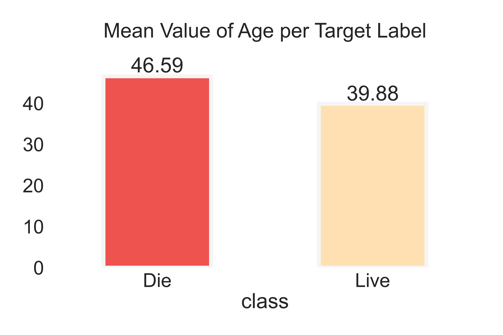

The table below summarizes the mean statistics of the numerical columns per target feature;

|class  |age   |bilirubin|alk_phosphate |sgot    |albumin |protime |
|-------|------|---------|--------------|--------|--------|--------|
|0      |46.594|2.446875 |113.03125     |97.21875|3.284375|51.15625|
|1      |39.877|1.1426230|98.63934426230|82.56557|3.979508|64.19672|

Summary of the standard deviation of the numerical columns per target feature is as shown below;

|class  |age   |bilirubin|alk_phosphate    |sgot   |albumin  |protime   |
|-------|------|---------|-----------------|-------|---------|----------|
|0      |9.9446|1.9144585|49.61755957059895|98.9668|0.6340395|15.2275416|
|1      |12.850|0.7134966|46.31281806284115|86.0046|0.5325658|16.7759368|

---

## Data Preprocessing

### Feature Matrix and Target Label

After cleaning the dataset, it was splitted into a **`feature matrix`**, **`X`** and a **`target lable`**, **`y`** (the target feature, `class`).

### Data Resampling

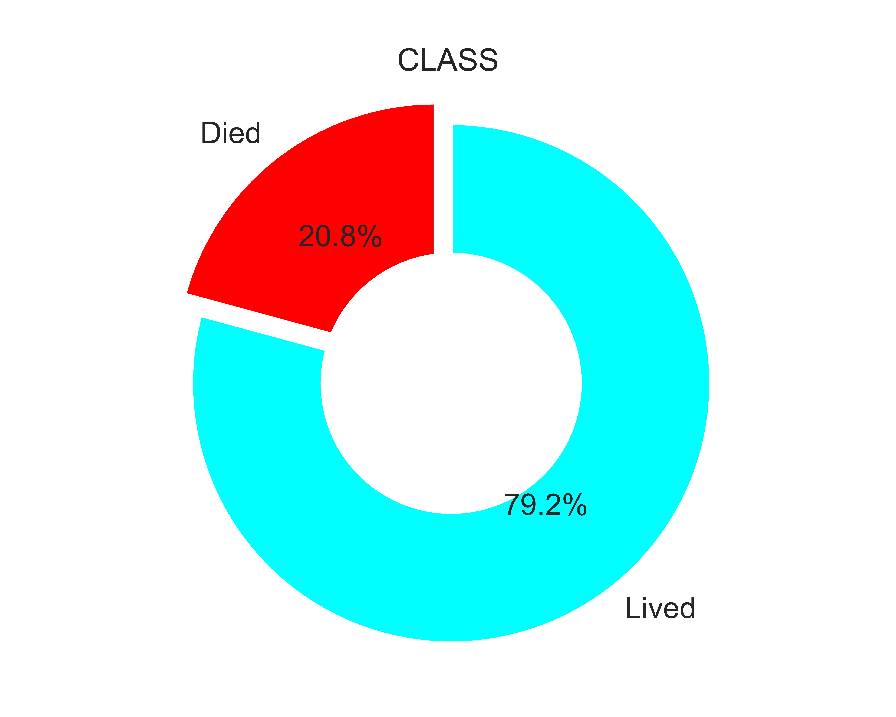

From the above figure, it can be observed that, there is a huge gap between the number of people who died and the total number of people of lived.This makes the entire dataset an imbalance dataset hence, the need to resample it to prevent inference/generalization issues. An oversampling technique was used to create synthetic data samples of the minority class to balance the dataset classes. The dataset was upsampled with Synthethic Minority Oversampling Technique (**[SMOTE](https://arxiv.org/abs/1106.1813)**).

### Feature Selection

After upsampling the dataset, `10` of the dataset features were selected for training the model using **`SelectKBest`** (A feature selection function from the `sklean` library). Below are the 10 features;

|top_10_features|
|---------------|
|protime        |
|alk_phosphate  |
|sgot           |
|age            |
|bilirubin      |
|fatigue        |
|spiders        |
|malaise        |
|ascites        |
|spleen_palpable|

### Train and Test Split

After selecting the data features to be used, the feature matrix and the target label was splitted into **`train and test sets`** with **`70% of the data for the training set`** and **`30% of the data for the testing set`**.

### Data Normalization

With the help of the **`StandardScaler preprocessing function`** from the **`sklearn library`**, the train and test set data was normalized to ensure that the range of data values are uniform to help the machine learning algorithms archive better results.

## Modelling

**`6 different machine learning algoritms`** were chosen to train them,
**`1 tree algorithm`** (**`Decision Tree`**), and **`5 ensemble algorithms`** (**`Random Forest, AdaBoost, ExtraTree, GradientBoosting and XGBOOST`**) to see which one will perform better on this classification task.
All modelling were done with the **`default parameters`** of the various algorithms with a random state value of **`81`** to ensure reproducibility of results.

### Cross-Validation

The algorithms were cross-validated on all the data features of the upsampled dataset and scored on the `f-1 evaluation metric` to see how they will performe. Below is the summary of the cross-validation results;

|model_name      |mean_score        |std_score           |
|----------------|------------------|--------------------|
|AdaBoost        |0.9117353017353016|0.04886856145761415 |
|RandomForest    |0.9069109714761886|0.06443632578694636 |
|XGBOOST         |0.9053093846572107|0.06278890820046037 |
|GradientBoosting|0.8822422493936737|0.06436207623004585 |
|ExtraTree       |0.8790874331953793|0.0996026887529337  |
|DecisionTree    |0.8700967308553513|0.049074871114510206|

### Modelling on Selected Data Features

After corss-validating the algorithms, they were then trained on the normalized data features that were selected using the `SelectKBest` function to see how they will perform as compared to the performance from the cross-validation results.

Below is the results for the model performance on the select data features.

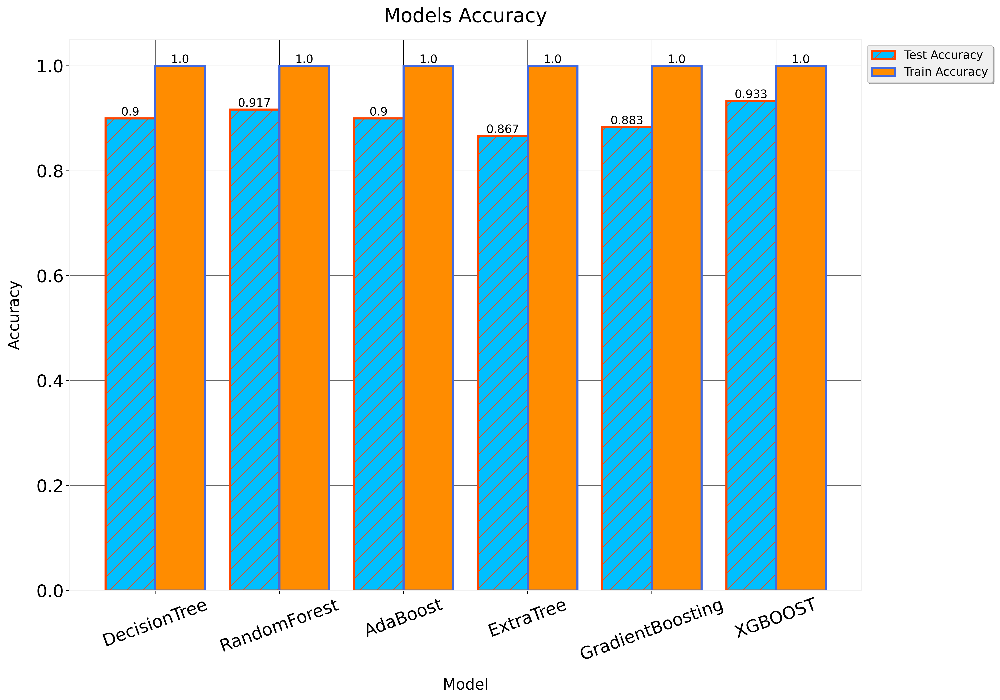

From the above resutls, it was observed that all the models overfitted on the training data with only **`XGBOOST`** that had a perfect fit on the testing data with an accuracy score of **`93.3%`**.

### Feature Importance

Feature Importance of all the algorithms was obtained to analyse the data features the models treated as important from the 10 selected features.
The figure below shows the feature importance of the **`XBOOST`** model. All other feature importance plot can be seen in the **`Predictive Analysis of Hepatitis Mortality  notebook`** and also inside the directory called **`figures`** in this repository.

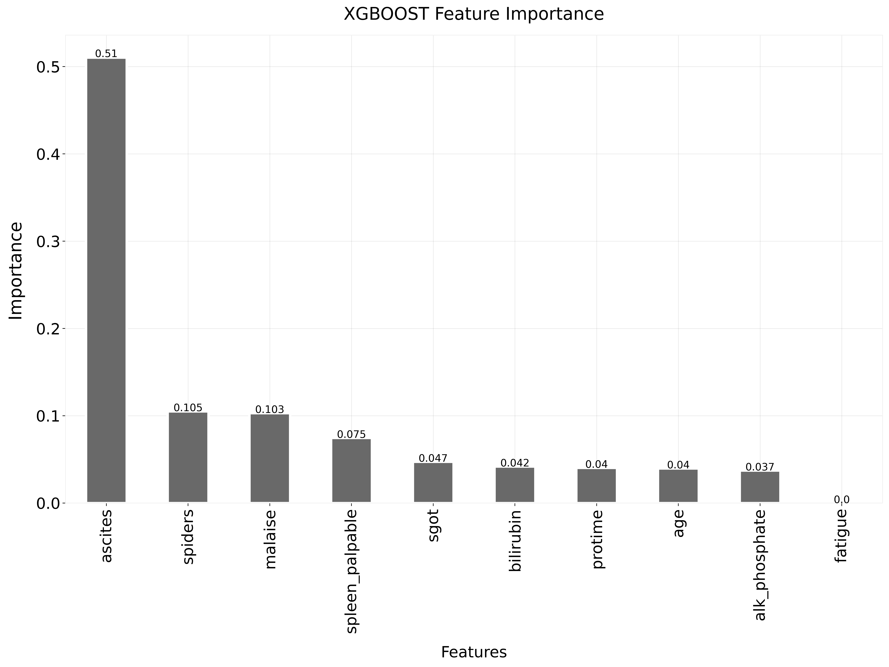

Below is the summary of feature importances (In ascending order) of all the models;

|DecisionTree   |RandomForest        |AdaBoost            |ExtraTree      |GradientBoosting   |XGBOOST             |
|---------------|--------------------|--------------------|---------------|-------------------|--------------------|
|ascites        |ascites             |bilirubin           |ascites        |ascites            |ascites             |
|age            |bilirubin           |sgot                |malaise        |bilirubin          |spiders             |
|spiders        |protime             |protime             |spiders        |spiders            |malaise             |
|bilirubin      |alk_phosphate       |age                 |bilirubin      |malaise            |spleen_palpable     |
|alk_phosphate  |malaise             |alk_phosphate       |age            |sgot               |sgot                |
|sgot           |sgot                |spiders             |sgot           |age                |bilirubin           |
|protime        |age                 |malaise             |protime        |alk_phosphate      |protime             |
|malaise        |spiders             |spleen_palpable     |alk_phosphate  |protime            |age                 |
|fatigue        |spleen_palpable     |ascites             |spleen_palpable|spleen_palpable    |alk_phosphate       |
|spleen_palpable|fatigue             |fatigue             |fatigue        |fatigue            |fatigue             |

From the above results, it observed that, the most importance feature that has an effect in determining whether a hepatitis patient will die or live is the **`ascites`** data feature with the least important being **`fatigue`**.

### Modelling on Top 8 Features

After obtaining the feature importance from the various algorithms, the top 8 features (as shown below);

|top_8_features |
|---------------|
|ascites        |
|spiders        |
|malaise        |
|spleen_palpable|
|sgot           |
|bilirubin      |
|protime        |
|age            |

from the **`XGBOOST`** model were chosen and the algorithms were once again trained on these features to see how they will perform.

The results of how the models performed on the 8 features is as shown below;

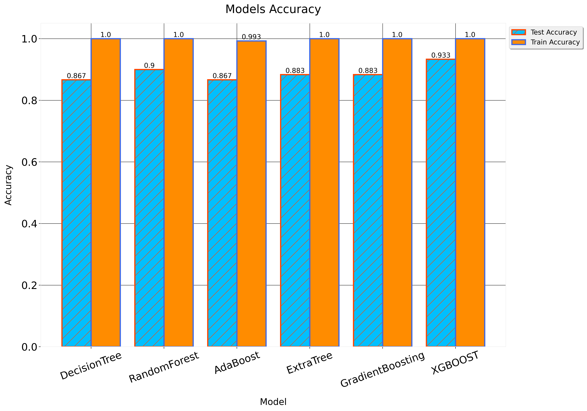

## Evaluation

After training the algorithms on the top 8 features, it was obeserved that, once again, all the models overfitted on the training data with only the **`XGBOOST`** model that had a perfect fit on the testing data with an accuracy score of **`93.3%`**.

Upon observing that, the **`XBOOST`** model was chosen as the final model to evaluate its performance.

The evaluation metrics that were chosen for this task are;

+ **`Accuracy Score`**,
+ **`Precision Score`**,
+ **`Recall Score`**,
+ and **`F1-Score`**.

The **`XBOOST`** model had;

+ An **`Accuracy Score of  0.9333`**
+ A **`Precision Score of 0.9459`**
+ A **`Recall Score of 0.9459`**
+ and **`F1-Score of 0.9459`**

Here, the results of the **`confusion matrix`**, **`ROC-AUC curve`** and **`residuals plot`** of the **`XBOOST`** model can be seen.

### Confusion Matrix

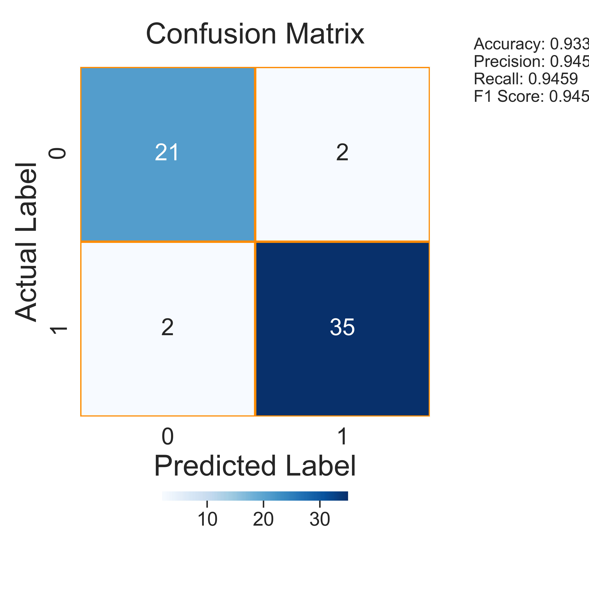

### ROC-AUC Curve

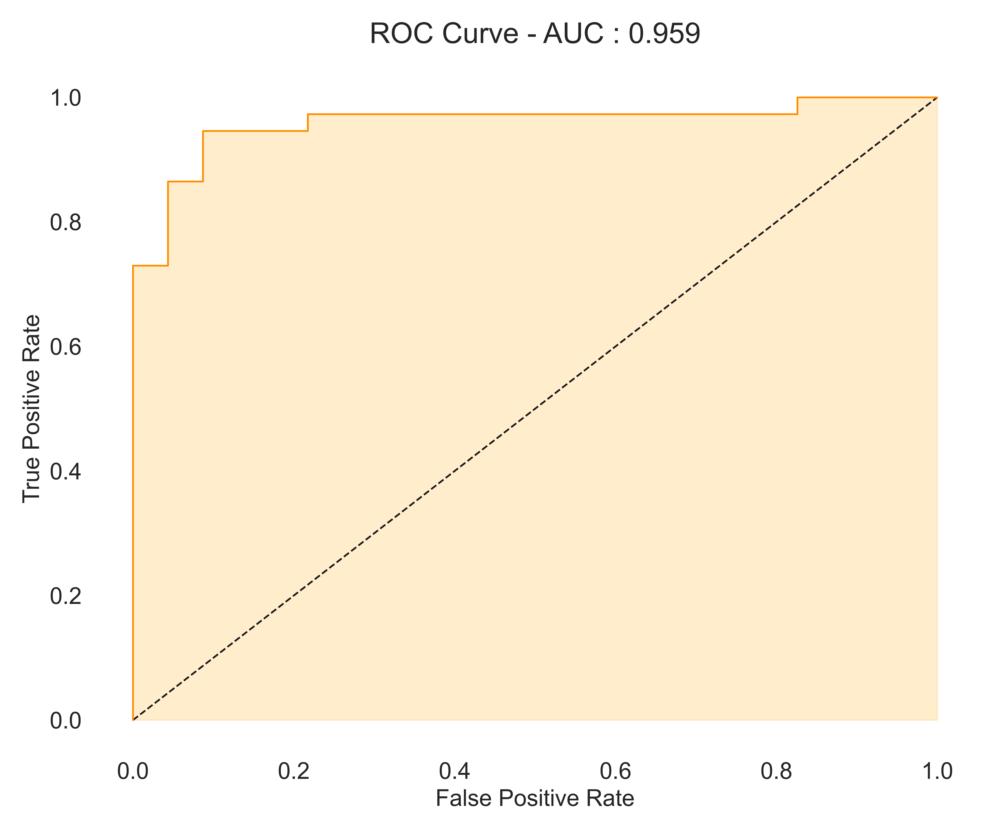

### Residuals Plot

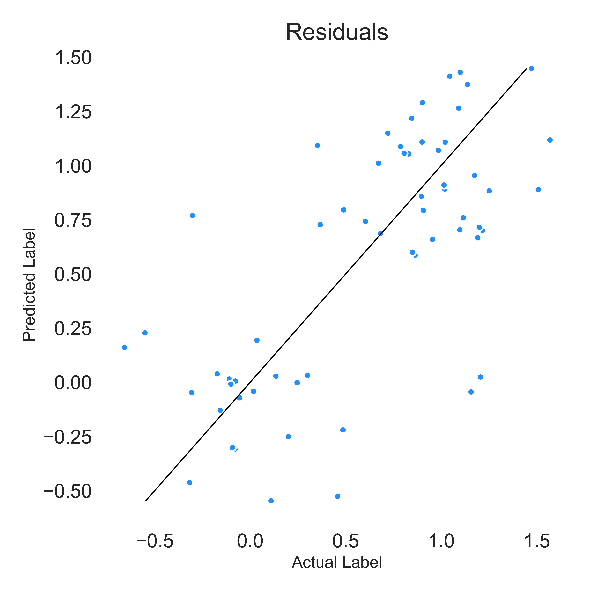

## Interpreting Model's Prediction

To understand the reason behind the model's prediction as opposed to seeing how the prediction was made as a black box, **_[Local Interpretable Model-agnostic Explanations (LIME)](https://arxiv.org/abs/1602.04938)_** was used to interpret the predictions to understand how they were made by the model and the contribution of each data feature that influenced the model's prediction.

The data instance below;

|feature        |value   |
|---------------|--------|
|ascites        |1       |
|spiders        |0       |
|malaise        |0       |
|spleen_palpable|1       |
|sgot           |0.834159|
|bilirubin      |0.935904|
|protime        |61      |
|age            |50      |

Was chosen from the hepatitis data to understand how the model predicted a label for this particular data instance. The true or actual label for this data instance is **`0`** which implies that the hepatitis patient with this data values died.

Below is the explainer results from LIME;

[LIME Explainer Results](figures/lime_explainer.png)

From the above results, it was observed that, the model truly predicted the right label (by given a prediction probability of **`0.58 to the Die(0)`** and **`0.42 to Live(1)`**) for the data that was provided. The bar charts represent the importance given to the data features and the color of the bar charts indicates the class the data features contribute to (**`orange for Live(1)`** and **`blue for Die(0)`**).

Here, a data table of the LIME results is presented;

|Die(0)                        |Live(1)             |
|------------------------------|--------------------|
|bilirubin > 0.27              |-0.22752123135006716|
|0.00 < spleen_palpable <= 1.00|0.1990908746755596  |
|47.25 < protime <= 61.00      |0.11083700746796282 |
|spiders <= 0.00               |-0.1069516050097003 |
|malaise <= 0.00               |-0.10396068626589255|
|sgot > 0.29                   |0.09675044747633771 |
|44.00 < age <= 50.75          |-0.04903321731045324|
|ascites <= 1.00               |0.0                 |

A negative value contributes to the prediction probability of the class, **`'Die(0)'`** and a positive value contributes **`'Live(1)'`**. The class that ends up with the highest prediction probability becoomes the prediction label of the data instance.

Below is a bar chart representation of the above data table; Red for Die(0) and green for Live(1).

[Local Explanation for class Live(1)](figures/lime_tabular_explainer.png)

## Analysing Model's Prediction

50 data samples with their respective labels were selected from the entire dataset, the data without their labels was fed to the classifier and the classifier's predicted outputs and the predicted probability for each output was obtained and analysed to observe the performance of the classifier. The model mis-classified four (4) out of the 50 samples and classified 46 correct which is quiet impressive. Below is the data table for the four incorrect predictions;

|ascites  |spiders |malaise|spleen_palpable|sgot|bilirubin|protime|age|class|predicted_outputs|prediction_probability|
|---------|--------|-------|---------------|----|---------|-------|---|-----|-----------------|----------------------|
|1        |0       |1      |1              |231 |0.9      |61     |37 |1    |0                |0.701336              |
|1        |0       |0      |1              |182 |2.8      |61     |34 |0    |1                |0.40191692            |
|0        |0       |0      |1              |118 |1.0      |23     |20 |1    |0                |0.68871826            |
|1        |0       |0      |1              |24  |0.7      |100    |34 |1    |0                |0.6259254             |

Taking **`ascites`** for example, from the above data table, it can observed that, out of the 3 patients who had extra fluid in the space between the tissues lining the abdomen and the organs in the abdominal cavity, the model predicted that two of them died and one lived whiles it was only one that died and two that lived.

Also, taking the patient who didn't have **`ascites`**, the model predicted that the patient died which isn't true because the actual label for that patient indicates that the patient lived.

The figure below shows the probabilities that the hepatitis patients from the 50 data samples will die in relation to ascites;

[Ascites Mortality Probability](figures/relplot_of_ascites_mortality_probability.png)

All other plots can be seen in the **`Predictive Analysis of Hepatitis Mortality  notebook`** and also inside the directory called **`figures`** in this repository.

## Conclusion and Recommendation

### Conclusion

This experiment aims at the prediction of vinho verde white wine quality from analytical tests. A dataset with 4898 entries was considered, which includes vinho verde white wine samples from the northwest region of Portugal. This experiment was treated as a classification task that was modelled on 6 different machine learning classification algorithms to see which one will perform better in predicting whether a white wine is to be considered as a low quality (0) or a high quality (1) wine.

This experiment present an approach;

+ in dealing with a dataset with imbalance classes,

+ the physicochemical properties of white wines that highly correlate with each other,

+ the mean and standard deviation statistics to be considered for the physicochemical properties per the quality of white wines,

+ and the features that can be considered important in predicting the quality of vinho verde white wines per the classifiers that were chosen for this task.

### Recommendation

More data instances for each of the data classes and perhaps adding more data features will increase model performance. Also, with regards to model performance, hyperparameter optimization can be employed in this experiment to tune the parameters of the various algorithms for better model performance.
Again, the model can be deployed in production as a web app, mobile app or a web api for end users like winegrowers and **_[sommeliers](https://en.wikipedia.org/wiki/Sommelier)_**.

## References

+ **_[\[1\]](https://archive.ics.uci.edu/ml/datasets/hepatitis)_** Dua, D. and Graff, C. (2019). UCI Machine Learning Repository [http://archive.ics.uci.edu/ml]. Irvine, CA: University of California, School of Information and Computer Science.

+ [2] @misc{ribeiro2016why,
      title={**_["Why Should I Trust You?": Explaining the Predictions of Any Classifier](https://arxiv.org/abs/1602.04938)_**},
      author={Marco Tulio Ribeiro and Sameer Singh and Carlos Guestrin},
      year={2016},
      eprint={1602.04938},
      archivePrefix={arXiv},
      primaryClass={cs.LG}
}
